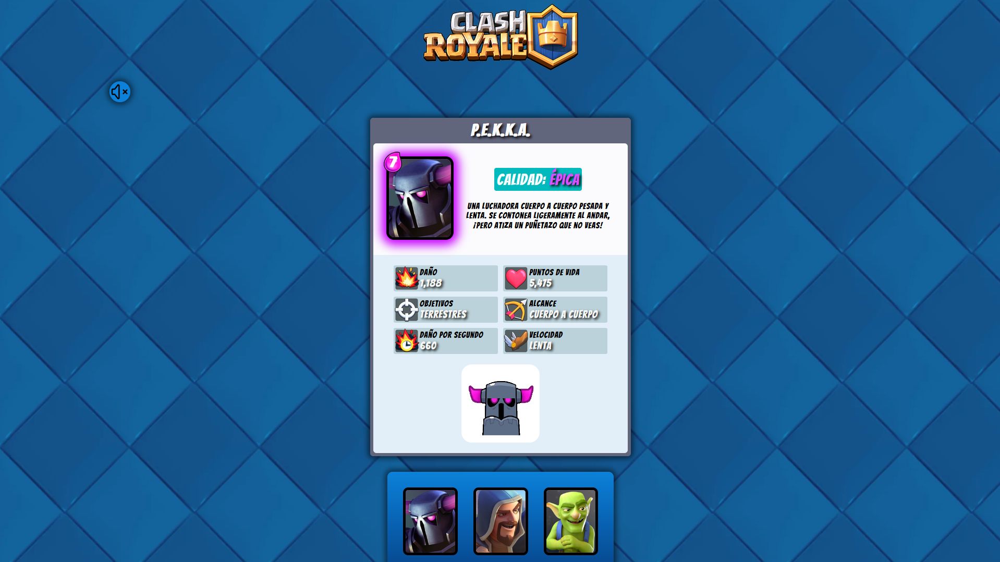

# Cards Royale

Esto es un pequeño ejercicio propuesto en clase para el intercambio de cartas mediante botones usando js.

## Tabla de contenidos

- [Descripción general](#descripcióngeneral)
	- [Captura de pantalla](#capturadepantalla)
	- [Enlaces](#enlaces)
	- [Creado con](#creado-con)

## Descripción general
La idea principal es diseñar  una pantalla con 3 pestañas (modelo Tabs) en donde se
carguen cartas, habrá tres botones en donde podremos intercambiar las cartas.
He elegido como temática el Clash Royale (porfi supercell no me demandes). También he añadido efectos de sonido y un boton para activar o desactivar la música de fondo.

### Captura de pantalla

### Enlaces

- URL de la solución: [Github](https://github.com/AlbertGit8/Cards-Royale)
- URL del sitio en vivo: [Netlify](https://royale-cards.netlify.app/)

### Creado con

- Marcado HTML5 semántico
- Propiedades personalizadas de CSS
- Flexbox
- Cuadrícula CSS
- Grid
- JS

